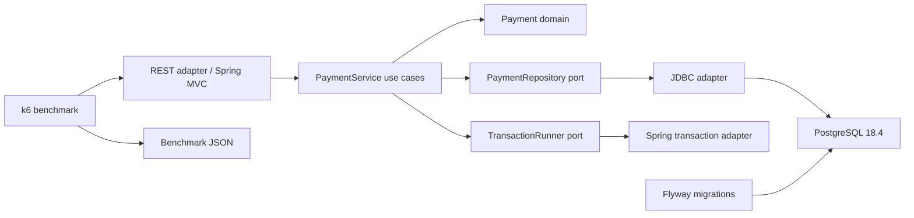

# #11 spring-hexagonal-payments: 131.414 ms p99 at 758.3 req/s

**Claim:** idempotent payment authorization and capture preserve domain rules while Spring, JDBC, and PostgreSQL remain replaceable adapters.

**Benchmark:** `131.414 ms` p99, `758.3 req/s`, and `95.65%` core line coverage across 7,583 measured authorizations with zero HTTP failures.

[](https://github.com/Brilhante29/spring-hexagonal-payments/actions/workflows/ci.yml)

## What It Proves

- Repeated authorization with the same idempotency key and payload returns the original payment.
- Reusing a key with a different payload returns a conflict instead of creating a second payment.
- PostgreSQL enforces the idempotency key atomically with `ON CONFLICT DO NOTHING`.
- Capture locks the payment row, changes state once, and is idempotent when replayed.
- Domain and application code import neither Spring, JDBC, HTTP, Flyway, nor PostgreSQL.
- The default path needs no cloud account, paid API, or secret.

## Run With Docker

```powershell
docker build -t spring-hexagonal-payments .
docker run --rm spring-hexagonal-payments
```

The second command starts ephemeral PostgreSQL, applies Flyway migrations, starts the API, warms it with 200 authorizations, runs k6, prints benchmark JSON, and exits.

To save the committed baseline:

```powershell
powershell -NoProfile -ExecutionPolicy Bypass -File tools/benchmark.ps1
```

Linux and macOS can use:

```bash
./tools/benchmark.sh
```

## Benchmark Result

| Metric | Baseline | Confirmation | Direction |
|---|---:|---:|---|
| p99_latency_ms | 131.414 | 134.165 | lower |
| throughput_rps | 758.3 | 772.8 | higher |
| measured_requests | 7,583 | 7,728 | higher |
| core_coverage_percent | 95.65 | 95.65 | >= 75 |
| checks_rate | 1.0 | 1.0 | exactly 1 |
| http_failure_rate | 0.0 | 0.0 | exactly 0 |

Inputs: 32 virtual users, 10-second measured window, 200 unmeasured warm-up authorizations, one ephemeral PostgreSQL 18.4 instance. Environment: Docker Desktop 27.4.0, Linux/x86_64, 16 CPUs, Java 25, Kotlin 2.4.10, Spring Boot 4.1.0, Jackson 3.1.4, and k6 2.1.0.

The confirmation differed by 2.09% in p99 and 1.91% in throughput. Measured on 2026-07-15.

Results:

- `benchmarks/results/payments-baseline.json`
- `benchmarks/results/payments-confirmation.json`

## Architecture



Dependency direction:

```text
HTTP + JDBC + Spring configuration -> application ports/use cases -> domain
```

The domain and use cases compile without framework annotations. `ArchitectureBoundaryTest` rejects imports from Spring, adapters, JDBC, and JPA in those packages.

## Payment Lifecycle

```text
AUTHORIZE -> AUTHORIZED -> CAPTURE -> CAPTURED
               ^                    |
               |---- replay --------|
```

Authorization is idempotent by request key and exact normalized payload. Capture is idempotent by state. There is no refund, settlement, ledger, or external acquirer claim.

## API

```http
POST /v1/payments
Idempotency-Key: order-42-attempt-1
Content-Type: application/json

{"amount_minor":2590,"currency":"BRL","merchant_reference":"order-42"}
```

- `201`: first authorization
- `200`: same key and same payload replayed
- `409`: same key with a different payload
- `400`: invalid request
- `404`: payment not found

Additional operations:

- `GET /v1/payments/{id}`
- `POST /v1/payments/{id}/capture`
- `GET /actuator/health`

Contract: `api/openapi.yaml`.

## Design Decisions

- Hexagonal architecture fits because transaction and persistence substitution are material to the payment invariant.
- REST fits synchronous commands with stable resources; GraphQL adds selection complexity without improving authorization or capture.
- Spring MVC and JDBC were selected over WebFlux and JPA: the workload is blocking PostgreSQL I/O and the SQL atomicity must remain visible.
- No Kafka or RabbitMQ is used because this slice has no asynchronous delivery requirement. An outbox belongs in the separate outbox project when event publication becomes part of the claim.
- Cloud mode is `none`. Kumo is reserved for projects that emulate AWS behavior; a managed PostgreSQL endpoint would change configuration at the adapter boundary, not the domain.
- One deployable service is enough. Microservices, CQRS, event sourcing, and sagas would add coordination without strengthening this proof.

## SOLID And Simplicity

- SRP: domain rules, use cases, HTTP mapping, JDBC, configuration, and benchmark are separate.
- OCP: another persistence or transaction adapter can implement the existing ports.
- LSP: the in-memory test adapter and JDBC adapter preserve repository behavior used by the service.
- ISP: ports expose only the reads, insert, update, and transaction operation the use cases require.
- DIP: `PaymentService` depends on ports, not Spring or PostgreSQL.
- KISS: two use cases, one aggregate, one table, no generic payment framework.
- YAGNI: no broker, cloud SDK, ORM, event store, service mesh, or distributed saga.

## Repository Layout

```text
src/main/.../domain/          payment aggregate and invariants
src/main/.../application/     use cases and ports
src/main/.../adapters/http/   REST input adapter
src/main/.../adapters/persistence/ JDBC output adapter
src/main/.../adapters/config/ Spring composition root
src/main/resources/db/        Flyway migration
src/test/                     domain, use-case, boundary, HTTP, PostgreSQL tests
benchmarks/                   k6 workload and committed results
api/openapi.yaml              public HTTP contract
sdd/                          decisions, benchmark plan, handoff, reuse review
```

## Verification

```powershell
./gradlew.bat test writeCoverage --no-daemon
powershell -NoProfile -ExecutionPolicy Bypass -File tools/validate-project.ps1
```

On Linux/macOS:

```bash
./gradlew test writeCoverage --no-daemon
powershell -NoProfile -ExecutionPolicy Bypass -File tools/validate-project.ps1
```

The Docker build runs tests, enforces at least 75% core line coverage, and packages the application. GitHub Actions additionally runs the PostgreSQL integration test through Testcontainers.

## Limits

- This is an authorization/capture slice, not a PCI-compliant processor or financial ledger.
- The benchmark is local and does not claim multi-region latency, failover, or exactly-once external effects.
- PostgreSQL is a single coordination point in the measured topology.
- Authentication, authorization, refunds, settlement, chargebacks, and acquirer integrations are intentionally out of scope.

## References

See `REFERENCES.md` for official documentation, licenses, and organizational references.
