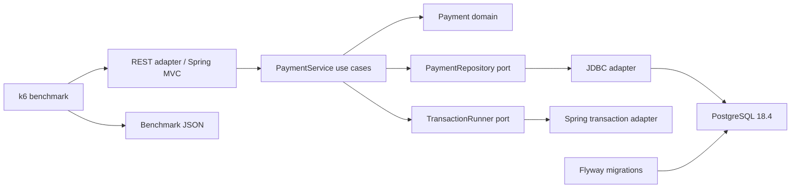

# Hexagonal Payments: Idempotent Authorization and Capture in Kotlin and Spring Boot

**Claim:** idempotent payment authorization and capture preserve domain rules while Spring, JDBC, and PostgreSQL remain replaceable adapters.

**Benchmark:** V1 p99 `87.201 ms`; publication V2 median p99 `108.122 ms`, mean `734.4 req/s`, minimum core line coverage `95.65%`, and zero HTTP failures across three Docker runs.

[](https://github.com/Brilhante29/spring-hexagonal-payments/actions/workflows/ci.yml)
[](LICENSE)
  

## Why this exists

Payment APIs fail in the most expensive way when clients retry. A mobile app times out, sends the same authorization again, and the customer is charged twice; a capture is replayed and the state machine breaks. Idempotency has to be enforced where the money is recorded, not hoped for in the client. This service shows how, while keeping the payment rules independent of the framework that serves them:

- Repeated authorization with the same idempotency key and payload returns the original payment.
- Reusing a key with a different payload returns `409` instead of creating a second payment.
- PostgreSQL enforces the idempotency key atomically with `ON CONFLICT DO NOTHING`.
- Capture locks the payment row, changes state once, and is idempotent when replayed.
- Domain and application code import neither Spring, JDBC, HTTP, Flyway, nor PostgreSQL, and an architecture test fails the build if that changes.
- The default path needs no cloud account, paid API, or secret.
- The [event-sourcing-orders](https://github.com/Brilhante29/event-sourcing-orders) service consumes a versioned authorization contract without sharing the payments database.

## Results

| Metric | V2 aggregate | Runs 1 / 2 / 3 | Direction |
|---|---:|---:|---|
| p99_latency_ms | 108.122 median | 87.201 / 108.122 / 120.869 | lower |
| throughput_rps | 734.4 mean | 801.2 / 756.3 / 645.7 | higher |
| measured_requests | 22,032 total | 8,012 / 7,563 / 6,457 | higher |
| core_coverage_percent | 95.65 minimum | 95.65 / 95.65 / 95.65 | >= 75 |
| checks_rate | 1.0 minimum | 1.0 / 1.0 / 1.0 | exactly 1 |
| http_failure_rate | 0.0 maximum | 0.0 / 0.0 / 0.0 | exactly 0 |

Inputs: 32 virtual users, 10-second measured window, 200 unmeasured warm-up authorizations, one ephemeral PostgreSQL 18.4 instance. Environment: Docker Desktop 27.4.0, Linux/x86_64, 16 CPUs, Java 25, Kotlin 2.4.10, Spring Boot 4.1.0, Jackson 3.1.4, and k6 2.1.0. Measured on 2026-07-30.

**How to read it:** the three-run p99 range is 87.201-120.869 ms. V2 exposes this variance and uses the median for the publication number instead of hiding instability. The invariants matter more than the latency: every check passed and no request failed in any run. Results live in [`benchmarks/results/payments-baseline.json`](benchmarks/results/payments-baseline.json) and [`benchmarks/results/payments-confirmation.json`](benchmarks/results/payments-confirmation.json).

## Quickstart

```bash
docker build -t spring-hexagonal-payments .
docker run --rm spring-hexagonal-payments
```

The second command starts ephemeral PostgreSQL, applies Flyway migrations, starts the API, warms it with 200 authorizations, runs k6, prints benchmark JSON, and exits.

## How it works


```mermaid
flowchart LR
  K["k6 benchmark"] --> H["REST adapter / Spring MVC"]
  H --> A["PaymentService use cases"]
  A --> D["Payment domain"]
  A --> P["PaymentRepository port"]
  A --> T["TransactionRunner port"]
  P --> J["JDBC adapter"]
  T --> S["Spring transaction adapter"]
  J --> DB["PostgreSQL 18.4"]
  F["Flyway migrations"] --> DB
  K --> R["Benchmark JSON"]
```

Dependency direction:

```text
HTTP + JDBC + Spring configuration -> application ports/use cases -> domain
```

The domain and use cases compile without framework annotations. `ArchitectureBoundaryTest` rejects imports from Spring, adapters, JDBC, and JPA in those packages.

### Payment lifecycle

```text
AUTHORIZE -> AUTHORIZED -> CAPTURE -> CAPTURED
               ^                    |
               |---- replay --------|
```

Authorization is idempotent by request key and exact normalized payload. Capture is idempotent by state. There is no refund, settlement, ledger, or external acquirer claim.

### API

```http
POST /v1/payments
Idempotency-Key: order-42-attempt-1
Content-Type: application/json

{"amount_minor":2590,"currency":"BRL","merchant_reference":"order-42"}
```

- `201`: first authorization
- `200`: same key and same payload replayed
- `409`: same key with a different payload
- `400`: invalid request
- `404`: payment not found

Additional operations: `GET /v1/payments/{id}`, `POST /v1/payments/{id}/capture`, and `GET /actuator/health`. The public contract is [`api/openapi.yaml`](api/openapi.yaml).

The macro integration contract is [`contracts/backend-reliability-platform.yaml`](contracts/backend-reliability-platform.yaml). The orders service maps `orderId` to `merchant_reference` and retries with `Idempotency-Key: order:{orderId}:authorize:v1`; `PlatformContractTest` prevents the local manifest from drifting away from OpenAPI.

## Design decisions

| Decision | Why | Rejected |
|---|---|---|
| Hexagonal architecture | Transaction and persistence substitution are material to the payment invariant | Layered MVC: controller, service, and repository folders alone would not enforce the dependency inversion the project claims |
| REST for commands | Authorization and capture are stable command and resource operations | GraphQL: adds client-driven selection without improving authorization or capture |
| Spring MVC with JDBC | The workload is blocking PostgreSQL I/O, and the idempotency SQL and row locking must stay visible | WebFlux and R2DBC (no proven benefit for blocking PostgreSQL); Spring Data JPA (hides the atomic SQL behind ORM behavior) |
| No message broker | This slice has no asynchronous delivery requirement | Kafka or RabbitMQ: event publication belongs in the separate [outbox-pattern](https://github.com/Brilhante29/outbox-pattern) project |
| No cloud emulation | A managed PostgreSQL endpoint would change configuration at the adapter boundary, not the domain | Kumo: reserved for projects that emulate AWS behavior |
| One deployable service | Enough to prove the invariant | Microservices, CQRS, event sourcing, and sagas: coordination without strengthening this proof |

### SOLID and simplicity

- SRP: domain rules, use cases, HTTP mapping, JDBC, configuration, and benchmark are separate.
- OCP: another persistence or transaction adapter can implement the existing ports.
- LSP: the in-memory test adapter and JDBC adapter preserve repository behavior used by the service.
- ISP: ports expose only the reads, insert, update, and transaction operation the use cases require.
- DIP: `PaymentService` depends on ports, not Spring or PostgreSQL.
- KISS: two use cases, one aggregate, one table, no generic payment framework.
- YAGNI: no broker, cloud SDK, ORM, event store, service mesh, or distributed saga.

## Testing

```bash
./gradlew test writeCoverage --no-daemon
powershell -NoProfile -ExecutionPolicy Bypass -File tools/validate-project.ps1
```

On Windows, use `./gradlew.bat`. The Docker build runs tests, enforces at least 75% core line coverage, and packages the application. GitHub Actions additionally runs the PostgreSQL integration test through Testcontainers.

## Limitations

- This is an authorization/capture slice, not a PCI-compliant processor or financial ledger.
- The benchmark is local and does not claim multi-region latency, failover, or exactly-once external effects.
- PostgreSQL is a single coordination point in the measured topology.
- Authentication, authorization, refunds, settlement, chargebacks, and acquirer integrations are intentionally out of scope.

## Reproducibility

1. Clone the repository and build the image: `docker build -t spring-hexagonal-payments .`
2. Run it: `docker run --rm spring-hexagonal-payments` prints the benchmark JSON.
3. Save a new baseline with `tools/benchmark.sh` (Linux and macOS) or `tools/benchmark.ps1` (Windows).
4. Compare it with the committed results in [`benchmarks/results/`](benchmarks/results).

## Project structure

```text
src/main/.../domain/          payment aggregate and invariants
src/main/.../application/     use cases and ports
src/main/.../adapters/http/   REST input adapter
src/main/.../adapters/persistence/ JDBC output adapter
src/main/.../adapters/config/ Spring composition root
src/main/resources/db/        Flyway migration
src/test/                     domain, use-case, boundary, HTTP, PostgreSQL tests
benchmarks/                   k6 workload and committed results
api/openapi.yaml              public HTTP contract
sdd/                          decisions, benchmark plan, handoff, reuse review
```

## How this repository is built

The project follows the spec-driven workflow of [portfolio-reuse-kit](https://github.com/Brilhante29/portfolio-reuse-kit). Requirements and decisions live in [`sdd/`](sdd) and [`openspec/`](openspec), and [`project.yaml`](project.yaml) records the architecture, stack, and rejected alternatives. Development is AI-assisted and human-governed: [`AGENTS.md`](AGENTS.md) and [`CLAUDE.md`](CLAUDE.md) hold the coding-agent instructions, while tests, validators, and CI decide what gets published.

## Related work

- [event-sourcing-orders](https://github.com/Brilhante29/event-sourcing-orders): the orders service that calls this API with idempotency keys.
- [outbox-pattern](https://github.com/Brilhante29/outbox-pattern): reliable event publication when payments need to emit events.
- [saga-orchestrator](https://github.com/Brilhante29/saga-orchestrator): coordinating several services with compensation.

See [`REFERENCES.md`](REFERENCES.md) for official documentation, licenses, and organizational references.

## Author

**Guilherme Brilhante**, software engineer working on scalable backends and production AI.
[LinkedIn](https://www.linkedin.com/in/guilhermefreirebrilhanteseveriano/) · [GitHub](https://github.com/Brilhante29) · [Publications](https://dblp.org/pid/353/6812.html)

## License

[MIT](LICENSE).
